# Decision Making Under Uncertainty with POMDPs.jl

<!-- julia blue 4063D8
julia green 389826
julia purple 9558B2
julia red CB3C33 -->

[](https://juliaacademy.com/courses/decision-making-under-uncertainty-with-pomdps-jl)
[](https://www.youtube.com/playlist?list=PLP8iPy9hna6QPqk4N8eBk0oXzLrLbOtTA)


Introduction to the [`POMDPs.jl`](https://github.com/JuliaPOMDP/POMDPs.jl) framework and its ecosystem.

<kbd>
<p align="center">
  <a href="https://github.com/mossr/julia-tufte-beamer/blob/julia-academy/pomdps.jl/julia-academy-pomdps.pdf">
    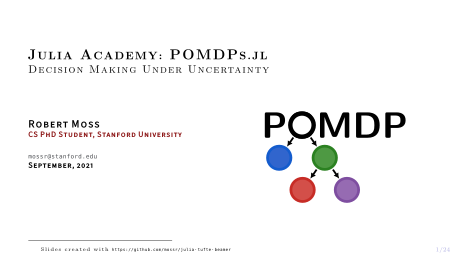
  </a>
</p>
</kbd>

<br/>
<br/>

The course covers how to build and solve decision making problems in uncertain environments using the POMDPs.jl ecosystem of Julia packages. Topics covered include sequential decision making frameworks—namely, Markov decision processes (MDPs) and partially observable Markov decision processes (POMDPs)—running simulations, online and offline solution methods (value iteration, Q-learning, SARSA, and Monte Carlo tree search), reinforcement learning, deep reinforcement learning (including proximal policy optimization (PPO), deep Q-networks (DQN), and actor-critic methods), imitation learning through behavior cloning of expert demonstrations, state estimation through particle filtering, belief updating, alpha vectors, approximate methods (including grid interpolation for local approximation value iteration), and black-box stress testing to validate autonomous systems. The course is intended for a wide audience—no prior MDP/POMDP knowledge is expected.

# Installation
1. [Install Julia (we used v1.6.2, other versions should work)](https://julialang.org/downloads/)
1. [Install Pluto.jl](https://github.com/fonsp/Pluto.jl#installation)
1. Clone this repo:
    ```bash
    git clone https://github.com/JuliaAcademy/Decision-Making-Under-Uncertainty
    ```
1. From the Julia REPL (`julia`), run Pluto (a web browser window will pop-up):
    ```julia
    julia> using Pluto
    julia> Pluto.run()
    ```
    _Or you can simply run the following in a terminal:_
    ```bash
    julia -E "using Pluto; Pluto.run()"
    ```
1. From Pluto, open one of the `.jl` notebook files located in the `Decision-Making-Under-Uncertainty/notebooks/` directory—enjoy!

# Lectures

The lectures can be found on [Julia Academy](https://juliaacademy.com/courses/decision-making-under-uncertainty-with-pomdps-jl) and [YouTube](https://www.youtube.com/playlist?list=PLP8iPy9hna6QPqk4N8eBk0oXzLrLbOtTA). They are broken down as follows.

## 0. Introduction

[](https://youtu.be/yrC2O7T7aKU?list=PLP8iPy9hna6QPqk4N8eBk0oXzLrLbOtTA)
[](https://github.com/mossr/julia-tufte-beamer/blob/julia-academy/pomdps.jl/julia-academy-pomdps-0-intro.pdf)

Brief introduction to the content of this course.

<kbd>
<p align="center">
  <a href="https://github.com/mossr/julia-tufte-beamer/blob/julia-academy/pomdps.jl/julia-academy-pomdps-0-intro.pdf">
    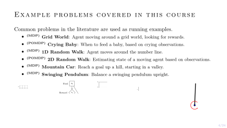
  </a>
</p>
</kbd>


## 1. MDPs: Markov Decision Processes

[](https://youtu.be/uHEjez97BvE?list=PLP8iPy9hna6QPqk4N8eBk0oXzLrLbOtTA)
[](https://github.com/mossr/julia-tufte-beamer/blob/julia-academy/pomdps.jl/julia-academy-pomdps-1-mdps.pdf)
[](https://htmlview.glitch.me/?https://github.com/JuliaAcademy/Decision-Making-Under-Uncertainty/blob/master/html/1-MDPs.jl.html)

Introduction to MDPs using the _Grid World_ problem.

<p align="center">
  <a href="https://htmlview.glitch.me/?https://github.com/JuliaAcademy/Decision-Making-Under-Uncertainty/blob/master/html/1-MDPs.jl.html">
    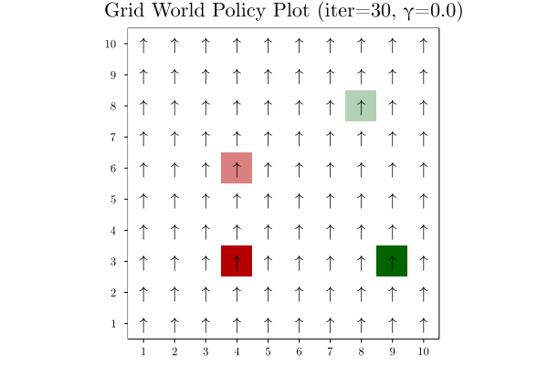
    <br/>
    <br/>
    <br/>
    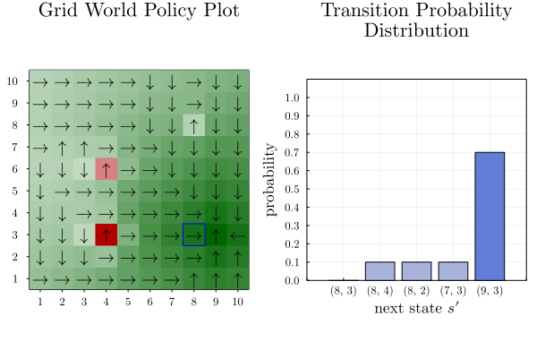
  </a>
</p>


## 2. POMDPs: Partially Observable Markov Decision Processes

[](https://youtu.be/KDFzObtE6cs?list=PLP8iPy9hna6QPqk4N8eBk0oXzLrLbOtTA)
[](https://github.com/mossr/julia-tufte-beamer/blob/julia-academy/pomdps.jl/julia-academy-pomdps-2-pomdps.pdf)
[](https://htmlview.glitch.me/?https://github.com/JuliaAcademy/Decision-Making-Under-Uncertainty/blob/master/html/2-POMDPs.jl.html)

Introduction to POMDPs using the _Crying Baby_ problem.

<p align="center">
  <a href="https://htmlview.glitch.me/?https://github.com/JuliaAcademy/Decision-Making-Under-Uncertainty/blob/master/html/2-POMDPs.jl.html">
    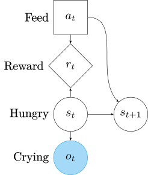
    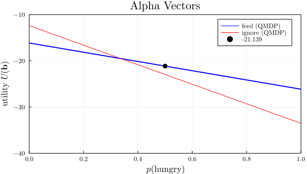
  </a>
</p>


## 3. State Estimation using Particle Filtering

[](https://youtu.be/CRNYgxT39bQ?list=PLP8iPy9hna6QPqk4N8eBk0oXzLrLbOtTA)
[](https://htmlview.glitch.me/?https://github.com/JuliaAcademy/Decision-Making-Under-Uncertainty/blob/master/html/3-ParticleFilters.jl.html)

Using beliefs to estimate the state of an agent through _particle filtering_.

<p align="center">
  <a href="https://htmlview.glitch.me/?https://github.com/JuliaAcademy/Decision-Making-Under-Uncertainty/blob/master/html/3-ParticleFilters.jl.html">
    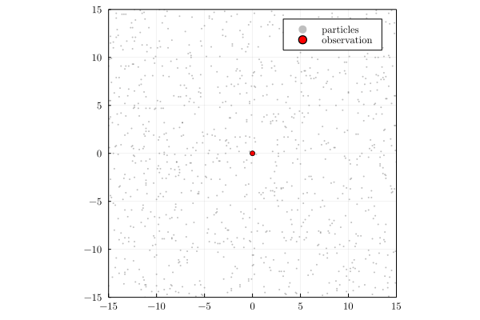
  </a>
</p>


## 4. Approximate Methods

[](https://youtu.be/hv2Vc8cU2YY?list=PLP8iPy9hna6QPqk4N8eBk0oXzLrLbOtTA)
[](https://htmlview.glitch.me/?https://github.com/JuliaAcademy/Decision-Making-Under-Uncertainty/blob/master/html/4-Approximate-Methods.jl.html)

Approximating a continuous space using grid interpolation and value function approximation.

<p align="center">
  <a href="https://htmlview.glitch.me/?https://github.com/JuliaAcademy/Decision-Making-Under-Uncertainty/blob/master/html/4-Approximate-Methods.jl.html">
    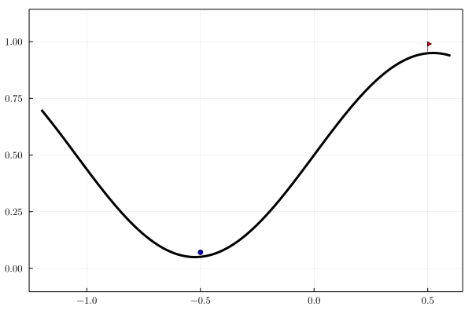
    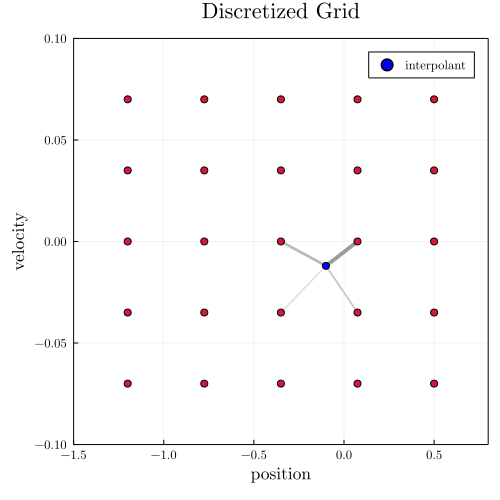
    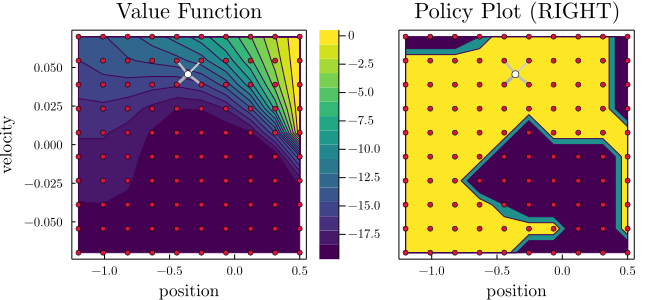
  </a>
</p>


## 5. Deep Reinforcement Learning

[](https://youtu.be/V1Py5AgTL7g?list=PLP8iPy9hna6QPqk4N8eBk0oXzLrLbOtTA)
[](https://htmlview.glitch.me/?https://github.com/JuliaAcademy/Decision-Making-Under-Uncertainty/blob/master/html/5-Deep-Reinforcement-Learning.jl.html)

Introduction to _deep reinforcement learning_ applied to the pendulum swing-up MDP.

<p align="center">
  <a href="https://htmlview.glitch.me/?https://github.com/JuliaAcademy/Decision-Making-Under-Uncertainty/blob/master/html/5-Deep-Reinforcement-Learning.jl.html">
    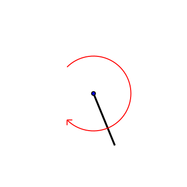
    
  </a>
</p>


## 6. Imitation Learning

[](https://youtu.be/0On85IIuXTA?list=PLP8iPy9hna6QPqk4N8eBk0oXzLrLbOtTA)
[](https://htmlview.glitch.me/?https://github.com/JuliaAcademy/Decision-Making-Under-Uncertainty/blob/master/html/6-Imitation-Learning.jl.html)

Introduction to _imitation learning_ using _behavior cloning_ of expert demonstrations.

<p align="center">
  <a href="https://htmlview.glitch.me/?https://github.com/JuliaAcademy/Decision-Making-Under-Uncertainty/blob/master/html/6-Imitation-Learning.jl.html">
    
    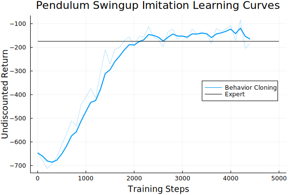
  </a>
</p>


## 7. Black-Box Validation

[](https://youtu.be/Q_38-vw5Pww?list=PLP8iPy9hna6QPqk4N8eBk0oXzLrLbOtTA)
[](https://htmlview.glitch.me/?https://github.com/JuliaAcademy/Decision-Making-Under-Uncertainty/blob/master/html/7-BlackBox-Validation.jl.html)

Stress testing a black-box system using _adaptive stress testing_.

<p align="center">
  <a href="https://htmlview.glitch.me/?https://github.com/JuliaAcademy/Decision-Making-Under-Uncertainty/blob/master/html/7-BlackBox-Validation.jl.html">
    
    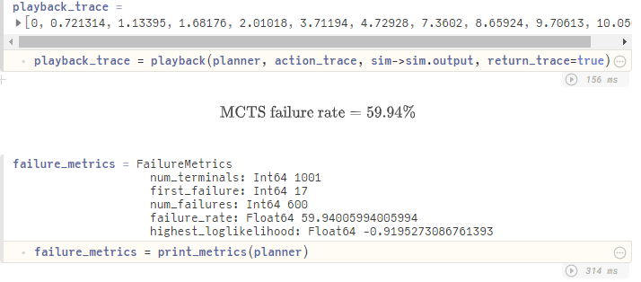
  </a>
</p>


---
Created and taught by [Robert Moss](https://github.com/mossr).
